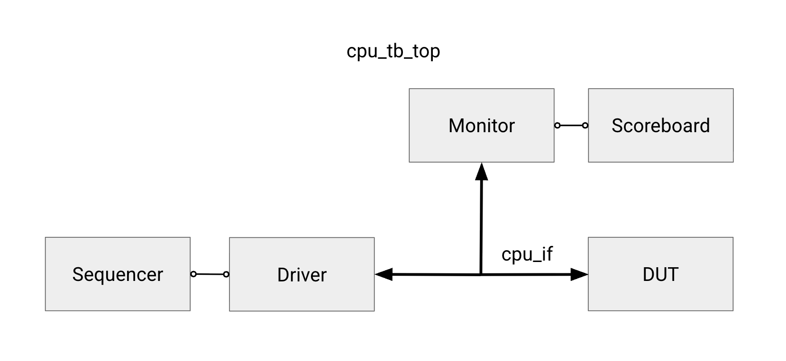
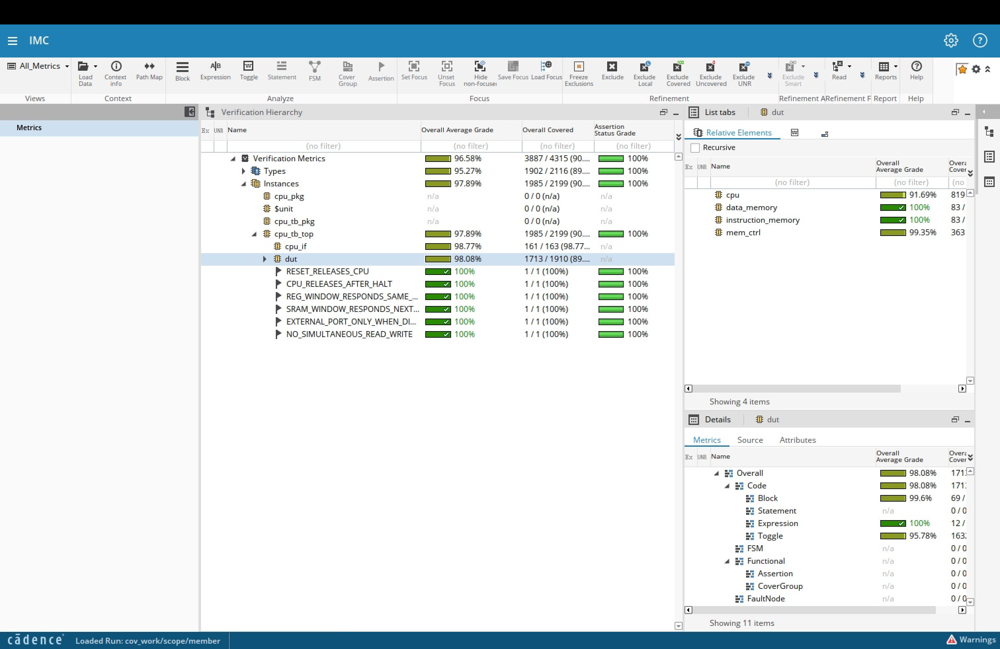

# RISC-V CPU Design Verification

A SystemVerilog verification environment for a small single-cycle-issue RISC-V CPU wrapped in a
chip-level top with instruction SRAM, data SRAM, and an external memory-mapped access port.

The testbench follows UVM-style separation of responsibilities (sequencer, driver, monitor,
scoreboard, reference model) without depending on the UVM library. It combines directed tests,
state-aware constrained-random program generation, SystemVerilog assertions, and RTL code coverage.
It was used to verify a hand-written CPU to 98%+ code coverage and to find and characterize three
injected bugs in an encrypted CPU variant.

## Highlights

- **Class-based testbench** with mailbox-connected components and a clocking-block interface to
  avoid testbench/RTL races.
- **Independent checking path:** the monitor reconstructs DUT behavior from chip pins only, and the
  scoreboard predicts results with an ISA-level reference model. It never trusts what the driver
  intended to send.
- **State-aware constrained random:** the sequencer tracks the architectural register state along
  the program's reachable path, so constraints (e.g. legal `lw`/`sw` effective addresses) can
  depend on values computed by earlier generated instructions while `rs1` stays fully random.
- **Protocol assertions** for external-port ownership, SRAM and register-file response timing, halt
  release, and reset behavior.
- **Bug hunt:** the same testbench, run against an encrypted CPU, exposed three bugs through
  random stimulus. Each was reduced to a minimal reproducer.

## Tools

- Cadence Xcelium (`xrun`): compilation and simulation
- Cadence SimVision: waveform debugging
- Cadence IMC: RTL code coverage
- SystemVerilog classes, mailboxes, constraints, assertions

## Design under test

### External address map

The external port is byte addressed and accepts word-aligned accesses. `addr_i[13:12]` selects a
window:

| `addr_i[13:12]` | Window | Base | Size | Access |
| --- | --- | --- | --- | --- |
| `2'b00` | Instruction SRAM | `0x0000` | 1024 words | read/write |
| `2'b01` | Data SRAM | `0x1000` | 1024 words | read/write |
| `2'b10` | Register file | `0x2000` | 32 words | read only |
| `2'b11` | Unmapped | — | — | none |

Word `n` is located at `base + n*4`.

### External-port protocol

- A write presents `addr_i`, `wdata_i`, and `w_en_i`. The request is captured at the next rising
  edge.
- A read holds `addr_i` and `r_en_i` until `rready_o` is observed. SRAM windows respond on the
  following cycle. The register-file window responds in the request cycle.
- `w_en_i` and `r_en_i` are never asserted together.
- The external port is serviced only while the CPU is disabled.
- A one-cycle pulse on `en_cpu_i` starts a program at address zero.
- `cpu_halted_o` pulses when `ebreak` retires. It is a pulse, not a persistent status bit.
- `halt_cpu_i` stops execution and returns the memories to the external port. A reset is required
  before starting another program.

### Test flow

Each test runs through six phases:

1. Reset the chip and idle all testbench-driven signals.
2. Load the program into instruction SRAM through the external port.
3. Load initial values into data SRAM.
4. Pulse `en_cpu_i` to start execution.
5. Wait for the halt pulse, with a bounded timeout.
6. Read architectural state back through the external port and compare it against the reference
   model's prediction.

## Testbench architecture



| File | Purpose |
| --- | --- |
| `src/verilog/tb/cpu_if.sv` | Chip signals plus a clocking block for race-free drive and sample. |
| `src/verilog/tb/cpu_seq_item.svh` | Randomized instruction item and encoder, including state-aware constraints. |
| `src/verilog/tb/cpu_xbar_item.svh` | External-port access item and monitor observation. |
| `src/verilog/tb/cpu_sequencer.svh` | Generates programs and accesses, tracks reachable generation state, sends requests by mailbox. |
| `src/verilog/tb/cpu_driver.svh` | Converts requests into cycle-accurate pin activity. The only component that drives DUT inputs. |
| `src/verilog/tb/cpu_monitor.svh` | Samples the interface and reconstructs external accesses, CPU memory traffic, reset, start, and halt. |
| `src/verilog/tb/cpu_ref_model.svh` | ISA-level model of the supported instructions, with no pipeline timing. |
| `src/verilog/tb/cpu_sb.svh` | Maintains shadow memories and compares monitor observations against predictions. |
| `src/verilog/tb/cpu_tb_pkg.sv` | Shared types, constants, helpers, and class includes. |
| `src/verilog/tb/cpu_tb_top.sv` | DUT instantiation, test sequence, and assertions. |
| `sim/behav/Include/cpu.include` | Source list compiled by Xcelium. |
| `sim/behav/Makefile` | Simulation, waveform, coverage, and bug-hunt targets. |

### How the components work together

The **sequencer** decides which operation to attempt and sends transaction objects through a
mailbox to the **driver**.

Some instruction constraints depend on the architectural state left behind by earlier generated
instructions. The sequencer keeps a private reference model that advances along the program's
reachable path and copies current register values into each instruction item before
randomization. This model is only used to generate stimulus. It never observes the DUT or decides
pass/fail.

The **monitor** samples the chip boundary on its own and emits transactions for external requests
and responses, CPU memory operations, reset, start, and halt. It never asks the driver what it
intended.

The **scoreboard** keeps shadow copies of instruction and data memory. On a CPU start it loads
those shadows into the **reference model**, which predicts final architectural state and the
ordered sequence of stores. Later monitor transactions are checked against those predictions.

Keeping these paths separate means a broken driver or DUT interface cannot agree with the
scoreboard and produce a false pass.

## Verification strategy

### Directed tests

Small named scenarios in `cpu_tb_top.sv` target one behavior each: arithmetic overflow and
carry-out, zero results, negative immediates, shift limits, `x0` reads, store/load round trips,
forward and backward branches (taken and not taken), read-after-write and load-use hazards, and
`ebreak` after a branch. See [testplan.md](testplan.md) for the full list with stimulus
and expected results.

### Constrained-random testing

Instruction constraints in `cpu_seq_item.svh` and external-port constraints in
`cpu_xbar_item.svh` include:

- `c_opcode`, `c_reg_bias`, `c_imm_unused`, `c_no_branch_at_end`, `c_align`, `c_reg_read_only`:
  opcode mix, register-selection bias, unused-field zeroing, safe program endings, and access
  legality.
- `c_imm_range`, `c_branch_target`, `c_valid_window`: legal immediate ranges, in-bounds branch
  targets, and valid external-port windows.
- `c_mem_align`: uses the register snapshot to require that `rs1 + imm` is word-aligned and falls
  entirely inside data SRAM, while leaving `rs1` unconstrained.
- `c_branch_taken_bias`: makes `beq` operands equal about 40% of the time so taken branches are
  well represented.
- `c_data_corners`: biases data toward boundary values.

Each random iteration resets the CPU and reinitializes memories so the DUT, scoreboard, and
generation model start from the same image. A timed-out or store-heavy program therefore cannot
contaminate the next iteration. Seeds are controlled through the Makefile:

```sh
make xrun SEED=1         # repeat a known run
make xrun SEED=random    # let Xcelium choose a new seed (logged as SVSEED)
```

### Assertions

| Assertion | Checks |
| --- | --- |
| Simultaneous read/write | `r_en_i` and `w_en_i` are never asserted together. |
| `EXTERNAL_PORT_ONLY_WHEN_DISABLED` | The external port is serviced only while the CPU is disabled. |
| `SRAM_WINDOW_RESPONDS_NEXT_CYCLE` | SRAM-window reads respond exactly one cycle later. |
| `REG_WINDOW_RESPONDS_SAME_CYCLE` | Register-file reads respond in the request cycle. |
| `CPU_RELEASES_AFTER_HALT` | Memories return to the external port after a halt. |
| `RESET_RELEASES_CPU` | Reset returns the chip to the idle, externally owned state. |

Each assertion was confirmed to fire by temporarily injecting the violation it guards against.

### Code coverage



The full suite reaches at least 98% code coverage under `cpu_tb_top.dut`. Exclusions are recorded
in `sim/behav/exclusions.vRefine`.

## Bug hunt: encrypted CPU

The completed testbench was rerun unchanged against an encrypted CPU containing injected bugs.
All three were first exposed by constrained-random stimulus, then reduced to minimal reproducers:

| Bug | Trigger | Behavior |
| --- | --- | --- |
| Load-to-branch forwarding | `beq` immediately after an `lw` that writes one of its source registers | `beq` compares against the register's value from before the load. |
| Store-to-load aliasing | `lw` immediately after `sw` to a different word address with matching low address bits | The load returns the data just stored instead of the data at the load address. |
| Partial branch compare | `beq` with operands equal in bits `[7:0]` but different in `[31:8]` | The branch is taken. Only the low 8 bits are compared. |

Seeds, failing iterations, minimized programs, nearby experiments, and waveform evidence for each
bug are documented in [testplan.md](testplan.md).

## Running

From `sim/behav` on a machine with the Cadence tools loaded:

```sh
make help                # list targets
make xrun                # compile and run the CPU suite (default seed)
make simvision           # open the waveform
make coverage            # open the coverage database in IMC
make bug_hunt            # run the suite against the encrypted CPU
make bug_hunt_simvision  # open the encrypted-CPU waveform
```

`make bug_hunt` writes `bug_hunt.log` and `bug_hunt_waves.shm` and leaves the CPU run's
`simulation.log` and `waves.shm` untouched.

## Repository layout

```
src/verilog/
  cpu/                CPU RTL (cpu_top, fetch, decode, execute, reg_file)
  tb/                 Testbench components
  bug_hunt_cpu_*/     Encrypted CPU variants
  chip_top.sv         Chip wrapper
  memory_controller.sv
  sram_wrapper.sv
sim/behav/            Makefile, source lists, coverage exclusions
testplan.md           Test plan, results, and bug reports
```

## References

- [The RISC-V Instruction Set Manual, Volume I](https://riscv.org/technical/specifications/)
- [VerificationGuide: SystemVerilog Testbench](https://verificationguide.com/systemverilog/systemverilog-testbench/)
- [ChipVerify: Constraint Random Verification](https://www.chipverify.com/verification/constraint-random-verification)
- [Doulos: SystemVerilog Assertions Tutorial](https://www.doulos.com/knowhow/systemverilog/systemverilog-tutorials/systemverilog-assertions-tutorial/)
- [Doulos: Clocking Tutorial](https://www.doulos.com/knowhow/systemverilog/systemverilog-tutorials/systemverilog-clocking-tutorial/)
